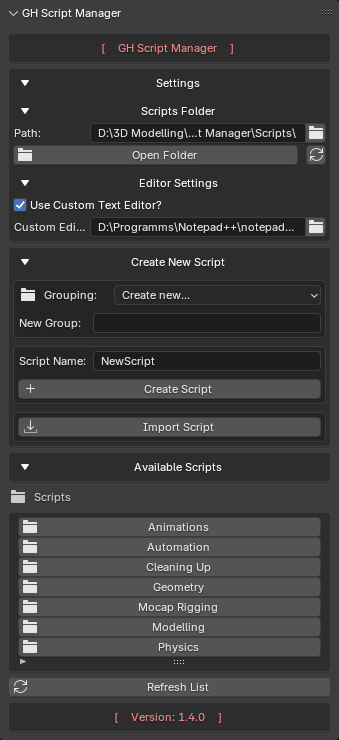

# GH Script Manager

Python Script Manager for Blender



---

## Compatibility

| Blender Version | Status |
| --------------- | ------ |
| 3.6 LTS         | ✅ Full |
| 4.x             | ✅ Full |
| 5.x             | ✅ Full |

**Current Version:** 1.4.0

---

## Features

### Script Management

* Create Python scripts directly inside Blender
* Organize scripts into groups and folders
* Import existing `.py` files
* Delete scripts with confirmation dialogs

### Script Execution

* Run Python scripts directly from Blender
* Execute scripts without opening the Text Editor
* Quickly access frequently used tools

### Script Editing

* Open scripts in a custom editor
* Default system editor support
* Blender Text Editor fallback
* Automatic editor detection

---

## Installation

1. Download the latest release
2. Open **Edit → Preferences → Add-ons**
3. Click **Install**
4. Select the add-on ZIP file
5. Enable **GH Script Manager**
6. Open:

```text
N-Panel → GH Tools → GH Script Manager
```

---

## Documentation

📚 Full documentation is available here:

**https://ghostwdfr.github.io/GH-Script-Manager/**

### Documentation Pages

* Main Menu
* Settings
* Creating Scripts
* Importing Scripts
* Running Scripts
* Editor Settings

---

## Community

* YouTube: https://www.youtube.com/@ghostwdfr
* Telegram: https://t.me/modelling_3d_ghostWDFR
* Discord: https://discord.gg/Yb9h4XGbWN

---

## License

Documentation may be redistributed unmodified with attribution to the original author.

Translations are permitted provided the content remains unmodified and attribution is preserved.
