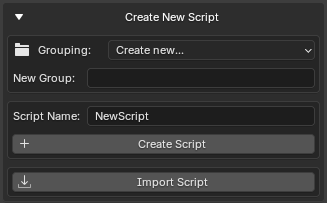

# Creating Scripts

---

The **Create New Script** section allows you to quickly create Python scripts directly from Blender.

Scripts can be created in the main scripts folder or inside custom groups for better organization.

<br>



**Create New Script Section**

---

## Creating a New Script

To create a new script:

1. Open **Create New Script**
2. Enter a script name
3. Select a target group (optional)
4. Press **Create Script**

The add-on automatically creates a valid Python file.

Example:

```text
MyTool
```

Result:

```text
MyTool.py
```

If the `.py` extension is not entered manually, it will be added automatically.

---

## Script Name Validation

GH Script Manager performs several validation checks before creating a file.

The following are not allowed:

* Empty names
* Invalid file system characters
* Reserved Windows filenames
* Absolute file paths
* Path traversal (`..`)

Examples of invalid names:

```text
My:Tool
```

```text
My/Tool
```

```text
CON
```

```text
../Tool
```

---

## Automatic Script Template

New scripts are created with a simple header.

Example:

```python
# Script Name: MyTool.py
```

This provides a starting point for development.

---

## Script Groups

Script groups are folders used to organize scripts.

Groups help keep large script collections manageable.

Examples:

```text
Utilities
```

```text
Animation
```

```text
Rigging
```

```text
Export
```

---

## Creating a New Group

Select:

```text
Grouping → Create New...
```

Then enter a group name.

Example:

```text
Utilities
```

The folder will be created automatically when the first script is added.

---

## Nested Groups

Multiple folder levels are supported.

Examples:

```text
Animation/Rigging
```

```text
Tools/Export
```

```text
Pipeline/Automation
```

Result:

```text
Scripts
├── Animation
│   └── Rigging
├── Tools
│   └── Export
└── Pipeline
    └── Automation
```

---

## Existing Groups

All existing folders inside the scripts directory automatically appear in the **Grouping** dropdown.

No manual registration is required.

The list updates whenever scripts are refreshed.

---

## Automatic Folder Creation

When creating a script inside a group:

```text
Animation/Rigging
```

GH Script Manager automatically creates missing folders.

Example:

```text
Scripts
└── Animation
    └── Rigging
        └── MyRigTool.py
```

---

## Opening the Script After Creation

After a script is created, it opens automatically.

The editor depends on your settings:

| Configuration | Result |
|--------------|----------|
| Custom Editor Disabled | Default system text editor opens |
| No Supported System Editor | Blender Text Editor opens as fallback |

This allows immediate editing without manually locating the file.

---

## Duplicate Script Protection

The add-on prevents accidental overwriting.

If a file already exists:

```text
MyTool.py
```

and you attempt to create another file with the same name in the same location, creation will be cancelled.

An error message will be displayed.

---

## Typical Workflow

Example workflow:

1. Create a group:

```text
Utilities
```

2. Create a script:

```text
RenameObjects
```

3. Script is created:

```text
Utilities/RenameObjects.py
```

4. The editor opens automatically

5. Start writing code