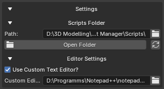

# Editor Settings

---

The **Editor Settings** section controls how scripts are opened for editing.

You can use it to:

* Enable a custom external editor
* Set the path to your preferred editor
* Open newly created scripts automatically
* Edit existing scripts from the **Selected Script** panel

<br>



**Editor Settings Panel**

---

## Use Custom Text Editor

The **Use Custom Text Editor?** option enables or disables a custom external editor.

When enabled, GH Script Manager will try to open scripts using the editor specified in **Custom Editor Path**.

When disabled, GH Script Manager will use the default available system editor.

---

## Custom Editor Path

The **Custom Editor Path** field stores the path to the editor executable.

Example:

```text
C:\Program Files\Microsoft VS Code\Code.exe
```

Another example:

```text
C:\Program Files\Notepad++\notepad++.exe
```

On macOS, `.app` applications are also supported.

Example:

```text
/Applications/Visual Studio Code.app
```

---

## Opening Scripts With a Custom Editor

When **Use Custom Text Editor?** is enabled and the editor path is valid:

* Newly created scripts open automatically in the custom editor
* Existing scripts open in the custom editor when pressing **Edit**

Example workflow:

```text
Create Script
↓
GH Script Manager creates the .py file
↓
Custom editor opens automatically
```

---

## Invalid Custom Editor Path

If the custom editor path is invalid or the editor cannot be found, the script will not open with the custom editor.

When creating a new script, GH Script Manager will show an error message if the custom editor is enabled but cannot be found.

Example:

```text
Custom editor not found. Check path in Editor Settings.
```

---

## Default Editor Behavior

If **Use Custom Text Editor?** is disabled, GH Script Manager uses the default available editor for your operating system.

Examples:

| Platform | Default Behavior                                            |
| -------- | ----------------------------------------------------------- |
| Windows  | Opens with Notepad                                          |
| macOS    | Opens with TextEdit                                         |
| Linux    | Tries common installed editors or the default system opener |

If no supported system editor is available, the script can be opened in Blender's Text Editor as a fallback.

---

## Editing Existing Scripts

To edit an existing script:

1. Open **Available Scripts**
2. Select a script
3. Click **Edit**

The script will open using the configured editor behavior.

If a valid custom editor is enabled, it will be used.

If not, GH Script Manager will use the default available editor.

---

## Saved Preferences

Editor settings are saved automatically.

Saved values include:

* Whether the custom editor is enabled
* The custom editor path

No manual saving is required.

The settings are restored when Blender is restarted.

---

## Recommended Setup

A common setup is to use Visual Studio Code as the custom editor.

Example:

```text
Use Custom Text Editor: Enabled
```

```text
Custom Editor Path:
C:\Program Files\Microsoft VS Code\Code.exe
```

This allows scripts to be managed from Blender while editing them in a full code editor.

---

## Notes

The editor path must point to a valid executable or supported application.

If you move, uninstall, or update your editor, you may need to update the path in GH Script Manager.
