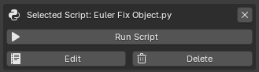

# Running Scripts

---

The **Run Script** feature allows you to execute Python scripts directly from Blender without manually opening the Text Editor.

This makes it easy to build personal tools, utilities, and workflow automation scripts that can be launched with a single click.

<br>



**Run Script Section**

---

## Selecting a Script

Before a script can be executed, it must be selected from the **Available Scripts** list.

To select a script:

1. Open **Available Scripts**
2. Navigate to the desired folder
3. Click the script name

Once selected, the script becomes active and the **Selected Script** panel appears.

Example:

```text
RenameObjects
```

---

## Running a Script

To execute the selected script:

1. Select a script
2. Click **Run Script**

The script is executed immediately inside Blender's Python environment.

Example:

```text
RenameObjects.py
```

Result:

```text
Executed script: RenameObjects.py
```

---

## How Execution Works

GH Script Manager executes the selected Python file inside Blender's Python environment.

The script is loaded from disk, compiled, and executed as a standalone Python file.

This means scripts have access to:

* Blender Python API (`bpy`)
* Current scene data
* Objects
* Materials
* Animation data
* Add-ons
* Custom Python modules available to Blender

Example:

```python
import bpy

for obj in bpy.context.selected_objects:
    obj.location.x += 1
```

During execution, the script receives standard Python file context:

```text
__name__ = "__main__"
__file__ = script_path
```

This makes it suitable for running Blender utilities, automation tools, and general Python scripts.

---

## Error Handling

If a script generates an error during execution, Blender will stop the script and display an error message.

Example:

```python
undefined_variable += 1
```

Result:

```text
Script execution failed: error message
```

The original script file is not modified.

---

## Running Imported Scripts

Imported scripts behave exactly the same as newly created scripts.

Example:

```text
Import Script
↓
Select Script
↓
Run Script
```

No additional setup is required.

---

## Script Requirements

GH Script Manager does not impose any restrictions on script contents.

Scripts may contain:

* Blender tools
* Operators
* Panels
* Utility functions
* Automation tools
* Custom workflows

As long as the script can run inside Blender's Python environment, it can be executed through the add-on.

---

## Safety Notes

Scripts execute with the same permissions as any Python script running inside Blender.

Only run scripts from trusted sources.

Be especially careful when executing scripts that:

* Modify files
* Delete data
* Install software
* Download external content

Always review unknown scripts before running them.

---

## Typical Workflow

1. Create or import a script

2. Select the script:

```text
RenameObjects.py
```

3. Click:

```text
Run Script
```

4. The script executes immediately

5. Continue working inside Blender
